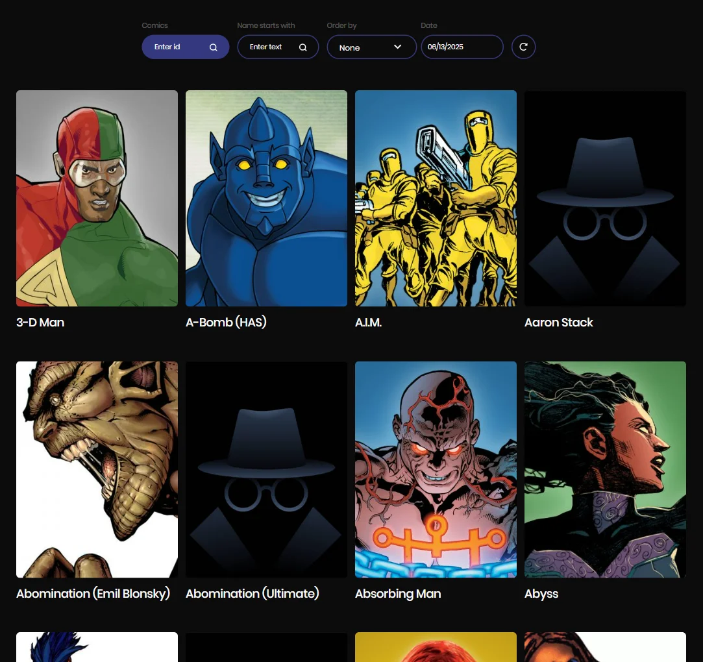

# Marvel Multiverse

Welcome to the **Marvel Multiverse** project! This app showcases Marvel
superheroes with dynamic sliders, detailed character lists, and advanced filters
— all in a responsive and engaging interface.

## 🌟 Features

### 🏠 Home Page

- **Manual Slider with Featured Heroes:** Highlighting 3 key characters —
  **Black Panther**, **Spider-Man**, and **Hulk** — with manual navigation
  controls.
- **Random Characters Slider (Autoplay):** A continuously auto-scrolling slider
  showcasing random Marvel characters for dynamic exploration.

### 🦸 Characters Page

- **Character List:** Explore a paginated list of Marvel heroes.
- **Filters:**
  - Search by name
  - Filter by comics
  - Select a "Modified Since" date
- **Pagination:** Easily navigate through pages of character results.
- **Search Results Message:** Displays a message if no characters match the
  selected filters.
- **Reset Filters:** Quickly clear all applied filters with a dedicated button.

### 🧾 Modal Window

- Clicking a character opens a modal window rendered through a portal.
- The modal displays detailed information about the selected character,
  including:
  - Character description
  - A list of comics related to the character

## 🖼️ Screenshots

 
 

## 🛠️ Technologies Used

## 🚀 Demo

Check out the live version deployed on Vercel:  
[Marvel Multiverse - Live Demo](https://multiverse-marvel.vercel.app/)

## 🧠 Disclaimer

This project is not affiliated with or endorsed by Marvel.  
All characters and related content are © Marvel and used under fair use.
